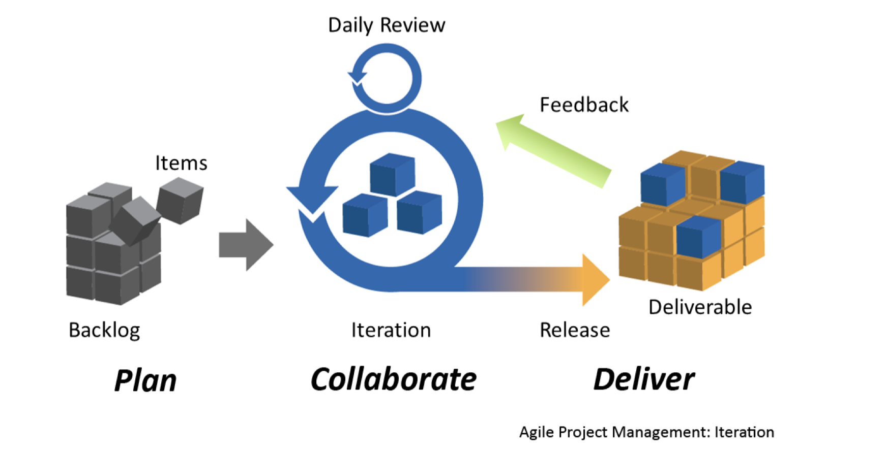

# Agile

## 漸增模式\(Incremental Model\)

## 敏捷開發\(Agile Development\)

## 敏捷宣言\(Agile Manifesto\)

## 敏捷開發的12個原則

1. 我們最優先的任務，是透過及早並持績地交付有價值的軟體來滿足客戶需求。
2. 竭誠歡迎改變需求，甚至已處開發後期亦然。敏捷流程掌控變更，以維護客戶的競爭優勢。
3. 經常交付可用的軟體，頻率可以從數週到數個月，以較短時間間隔為佳。
4. 業務人員與開發者必須在專案全程中天天一起工作。
5. 以積極的個人來建構專案，給予他們所需的環境與支援，並信任他們可以完成工作。
6. 面對面的溝通是傳遞資訊給開發團隊及團隊成員之間效率最高且效果最佳的方法。
7. 可用的軟體是最主要的進度量測方法。
8. 敏捷程序提倡可持續的開發。贊助者、開發者及使用者應當能不斷地維持穩定的步調。
9. 持續追求優越的技術與優良的設計，以強化敏捷性。
10. 精簡─或最大化未完成工作量之技藝─是不可或缺的。
11. 最佳的架構、需求與設計皆來自於能自我組織的團隊。
12. 團隊定期自省如何更有效率，並據之適當地調整與修正自己的行為。

## Agile開發相關問答

1. 敏捷開發重視的是什麼？
   1. 個人與互動
   2. 可用的軟體
   3. 與客戶合作
   4. 回應變化
2. 附加在User Story之Acceptance Test，其：
   1. 主要目的：描述User Story的細節，設定User Story是否完成的標準
   2. 由誰負責撰寫：客戶方
   3. 什麼時候撰寫：於Coding之前撰寫
3. 使用User Story的敏捷開發，何謂3C？
   1. Card
   2. Conversation
   3. Confirmation
4. 需求評估所使用之Kano模型，將需求分為哪三類？
   1. 基本型
   2. 期望型
   3. 魅力型
5. 估算使用者故事大小，最常用的方法？
   * Planning Poker
6. 估算使用者故事大小，最常用的單位？
   1. 故事點
   1. 理想工作天
7. 在Release Planning時，有哪兩種不同的驅動方式？
   1. Date-Driven
   2. Feature-Driven
8. UML全稱
   * Unified Modeling Language
9. UML統一：
   1. 統一了Notation
   2. 沒有統一Process
10. UML主要用途：
    1. modeling
    2. write software blueprint
    3. visualization, specification, construction, documentation
11. 使用瀑布模式有何缺點？
    1. 使用者需求不詳盡，導致後續階段的不確定性
    2. 太慢讓使用者看到系統，可能導致系統不合使用者需求
    3. 初始階段錯誤會導致連鎖反應，使損失擴大效果
12. 相對瀑布模式，使用漸增模式開發軟體的優點
    1. 避免錯誤放大效應
    2. 提早讓使用者見到並操作系統，使用者之意見得提早反映
    3. 較小之Increment容易管理、開發及測試
    4. 較容易應付發展過程中不斷變動之使用者需求
13. 請解釋敏捷開發中Incremental的意義
    * 將一個大專案切割成數個小專案，每個小專案會產生一部份可執行的軟體，整個系統依此程序漸次完成
14. 請解釋敏捷開發中Iteration的意義
    * 將一個大專案切割成數個小專案，每個小專案約一到四週，進行分析、設計、製作、測試工作，最後產生可執行之軟體，加到系統當中
15. 使用者角色(User Role)有哪些屬性？
    1. 目的
    2. 使用頻率
    3. 軟硬體專業度
    4. 領域專業度
    5. 類似軟體熟悉度
16. 請列出Release Planning之主要工作
    1. 決定滿足條件
    2. 估算使用者故事大小
    3. 決定迭代時間長度
    4. 估算速度
    5. 排定使用者故事優先順序
    6. 選入使用者故事及交付日期
17. 請解釋Use Case Diagram之用途
    1. 用以表現系統之邊界及系統所存在之環境(context)
    2. 用以塑模使用者之需求及系統之功能
18. 請列舉看板方法之三個原則
    1. visualization
    2. Limit WIP
    3. manage flow
19. Activity Diagram的使用時機？
    1. 描述業務流程或工作流程
    2. 描述使用者與系統之互動流程
    3. 描述操作流程
    4. 描述類別中操作之邏輯
20. 資料庫設計之步驟：
    1. 需求的搜集與分析
    2. 概想資料庫設計
    3. 資料模型轉換
    4. 實際資料庫設計
21. 以ER模型進行邏輯資料庫設計時，如何處理一對一及多對多的關係？
    1. 一對一：合併兩個實體
    2. 多對多：將原關係變成實體，另建兩個一對多的關係以連接原實體
22. 以ER模型進行邏輯資料庫設計時，如何處理實體、屬性及一對多的關係？
    1. 實體：轉換成表格
    2. 屬性：轉換成欄位
    3. 一對多：將「一」所代表表格之PK，複製到「多」所代表表格中，並設定成FK
23. 正規化之目的？
    * 資料在新增、修改或刪除時，整個系統相關資料仍能維持正確良好的狀態
24. 正規化規則：
    1. 第一正規化：去除多值屬性
    2. 第二正規化：去除只與部分主鍵相關欄位
    3. 第三正規化：去除除主鍵外有相依關係的欄位
