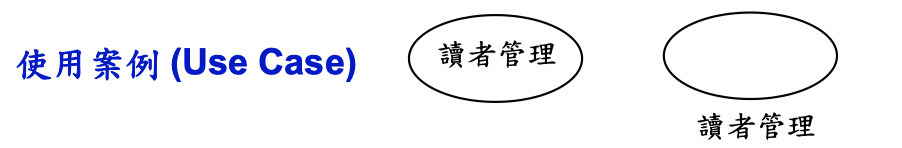
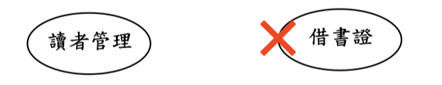
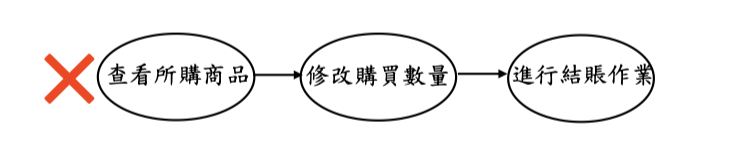
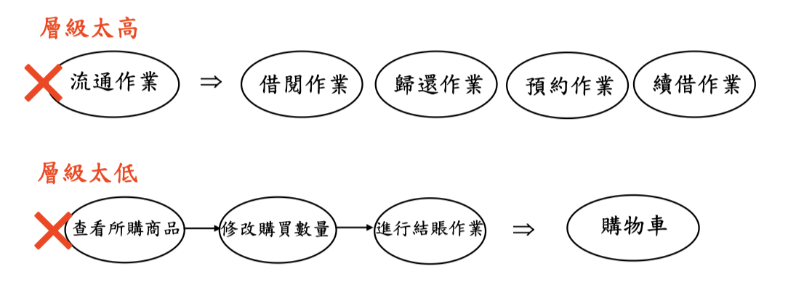
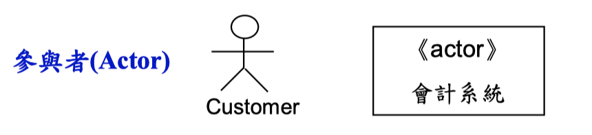
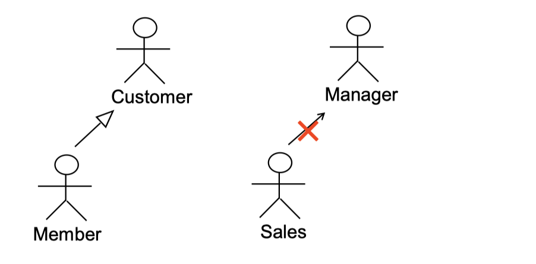
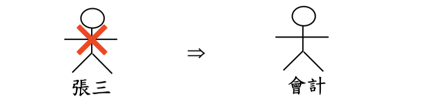
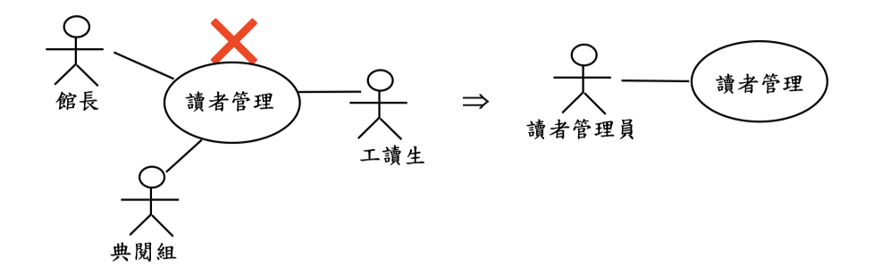
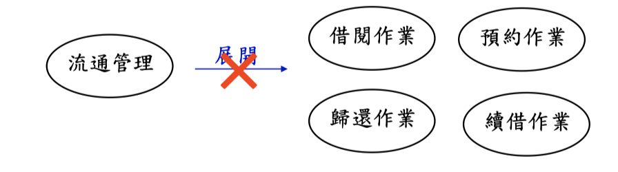
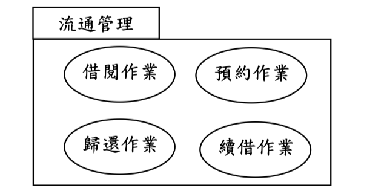

# Use Case & Actor

## Use Case Model

使用案例模型包括：

- 業務流程描述：Activity Diagram
- 使用者需求與系統功能：Use Case Diagram
- 使用案例事件流程：Use Case Description
- 使用者故事及驗收測試：User Story and Acceptance Test
- 使用案例情節：Activity Diagram
- UI設計：User-Interface Prototype

## Use Case 符號

## 使用案例注意事項

1. 使用案例之名稱通常是一個動詞片語

2. 使用案例間之關係通常只有三種：
   - 一般化
   - 包含
   - 擴充
**不能有表現流程、順序等關係出現**

↑應以購物車呈現

3. 使用案例應為EBP(Elementary Business Process)層級

## Actor

### Actor 符號

- 參與者為達到某項特殊目的，在系統之內所執行的一連串行動
- 對系統而言，使用者可以扮演的角色；或是存在系統之外的一個實體，例如： 另一個系統或是一個資料庫
- 參與者是在**系統之外**，但又與系統有關之實體
- 若參與者是人類，UML是以人形符號來表現；否則為增加視覺效果，可以使用 UML擴充機制中之造型 (stereotype)機制來表現
- 參與者與使用案例間是以關連(Association)連接，代表資料之傳送與接收

### 參與者注意事項

1. 參與者間可以有**一般化**(Generalization)之關係，參與者間不必有其他關係存在，因為那已是系統之外的部份

2. 參與者應是使用者可以扮演的角色，而非特定之人

3. 參與者是角色，而非職務

## Use Case Diagram

### 使用案例圖注意事項

1. 使用案例圖沒有階層性

2. 使用案例圖中可用套件符號來表示使用案例間之相關性

