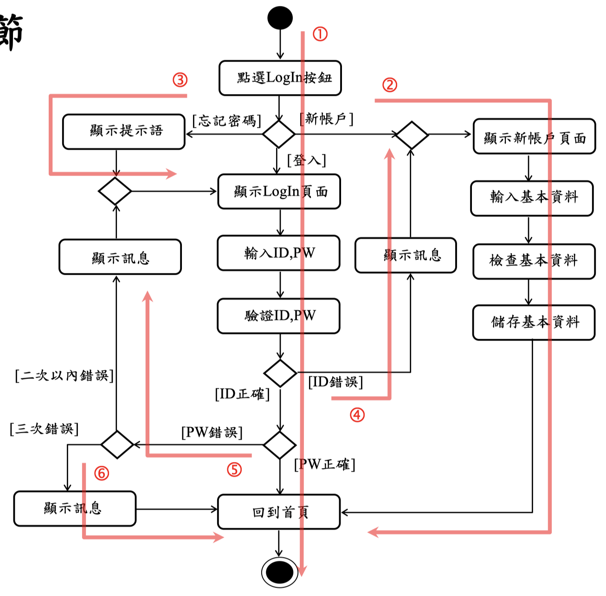
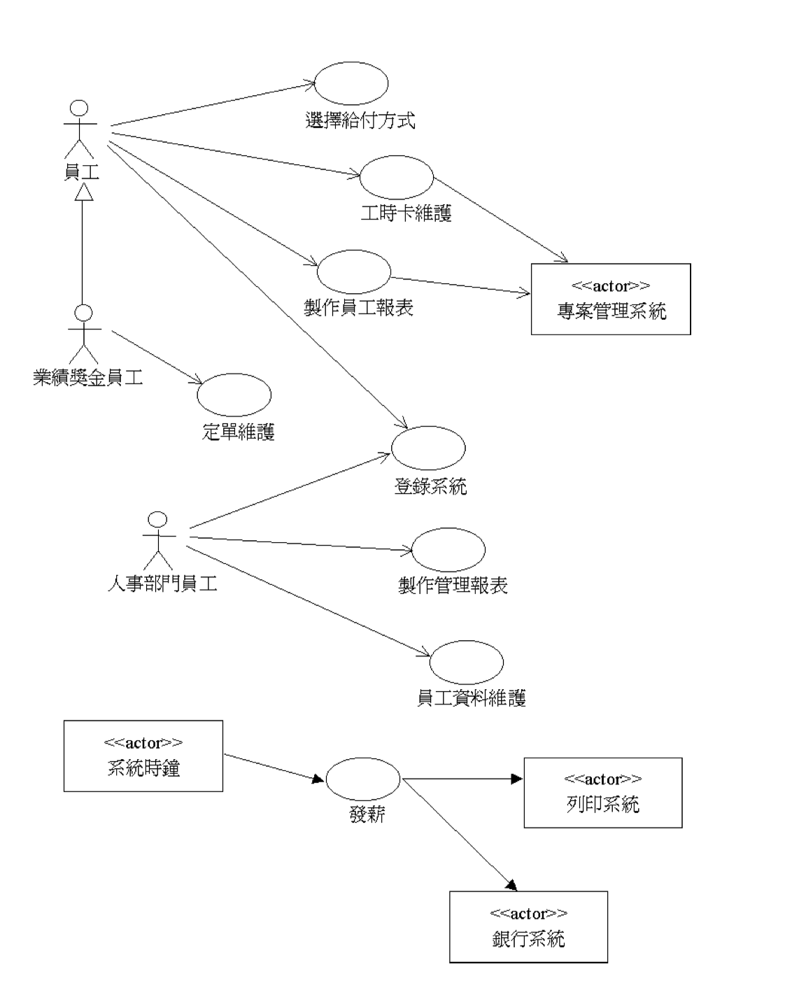
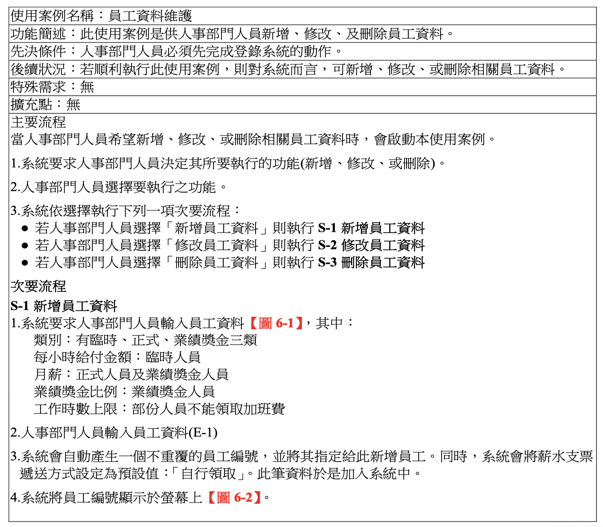
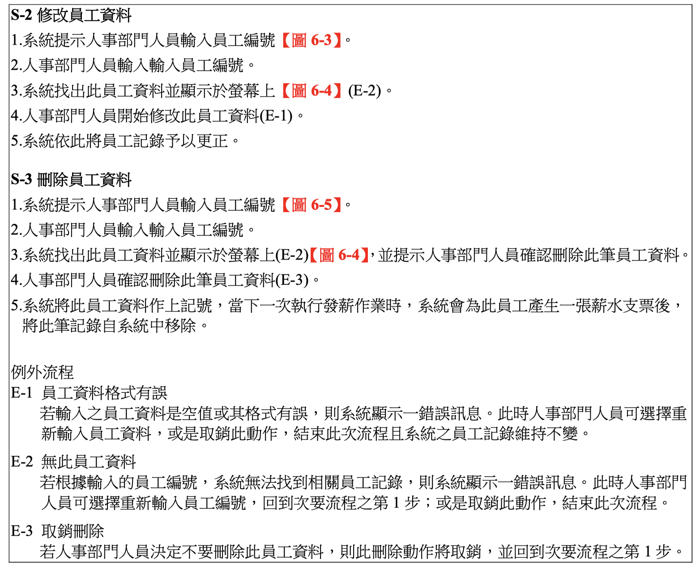
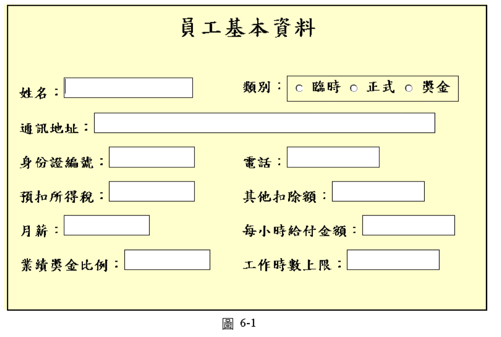

# Use Case

## Use Case Model

使用案例模型包括：

* 業務流程描述：Activity Diagram
* 使用者需求與系統功能：Use Case Diagram
* 使用案例事件流程：Use Case Description
* 使用者故事及驗收測試：User Story and Acceptance Test
* 使用案例情節：Activity Diagram
* UI設計：User-Interface Prototype

## Use Case 符號

## 使用案例注意事項

1. 使用案例之名稱通常是一個動詞片語

   

2. 使用案例間之關係通常只有三種：
   * 一般化
   * 包含
   * 擴充

     **不能有表現流程、順序等關係出現**

     

     ↑應以購物車呈現
3. 使用案例應為EBP\(Elementary Business Process\)層級 

## Actor

### Actor 符號

* 參與者為達到某項特殊目的，在系統之內所執行的一連串行動
* 對系統而言，使用者可以扮演的角色；或是存在系統之外的一個實體，例如： 另一個系統或是一個資料庫
* 參與者是在**系統之外**，但又與系統有關之實體
* 若參與者是人類，UML是以人形符號來表現；否則為增加視覺效果，可以使用 UML擴充機制中之造型 \(stereotype\)機制來表現
* 參與者與使用案例間是以關連\(Association\)連接，代表資料之傳送與接收

### 參與者注意事項

1. 參與者間可以有**一般化**\(Generalization\)之關係，參與者間不必有其他關係存在，因為那已是系統之外的部份

   

2. 參與者應是使用者可以扮演的角色，而非特定之人

   

3. 參與者是角色，而非職務

   

## Use Case Diagram

### 使用案例圖注意事項

1. 使用案例圖沒有階層性

   

2. 使用案例圖中可用套件符號來表示使用案例間之相關性

   

### 使用案例敘述

1. 在撰寫程式前，先確定使用案例之細節\(程序及邏輯\)
2. 描述系統作什麼\(what\)而非定義如何作\(how\)
3. 使用案例敘述通常包括下列項目：
   * 使用案例名稱 \(Use Case Name\)
   * 功能簡述 \(Brief Description\)
   * 先決條件 \(Precondition\)
   * 後續狀況 \(Post condition\)
   * 特殊需求 \(Special Requirements\)
   * 擴充點 \(Extension Points\)
   * 事件流程 \(Flow of Events\)

### 使用案例敘述之項目

> 需求:
>
> * 功能性：use case diagram
> * 非功能性：品質\(測試\)

1. 使用案例名稱 \(Use Case Name\)
   * 使用案例名稱必須和使用案例圖中之名稱相同
2. 功能簡述 \(Brief Description\)
   * 說明本使用案例之功能
3. 先決條件 \(Precondition\)
   * 在進行此使用案例前，系統必需滿足之條件
4. 後續狀況 \(Post condition\)
   * 當使用案例結束時，系統必需滿足之狀
5. 特殊需求 \(Special Requirements\)
   * performance, reliability\(信賴度or可靠度\), availability, accuracy, security等非功能性需求
   * > Mean Time Between Failures\(MTBF,平均故障間隔\)=2000hrs 數字越大表示越不容易出錯
6. 擴充點 \(Extension Points\)
   * 列舉本使用案例所有的擴充點
7. 事件流程 \(Flow of Events\)

> 以上前6項是表頭

### 事件流程

1. 是參與者與系統間之一連串互動過程
2. 使用案例中有兩種事件流程：
   * **主要事件流程** \(main flow of events\)，或稱基本事件途徑\(basic course of events\)，簡稱主要流程
   * **例外事件流程** \(exceptional flow of events\)，或稱替代行動途徑\(alternate course of events\)，簡稱例外流程
     * > 錯誤流程、較不常經過\(ex:忘記密碼\)
3. 主要事件流程是描述在正常狀況下，參與者和使用案例會遵循的一個由開始到結 束之完整主要路徑。基本假設是參與者不會出錯，且系統也不會產生錯誤
4. 例外事件流程是使用案例中代表錯誤狀況的路徑，或是參與者及系統較不常經過 的路徑

### 主要事件流程

1. Customer在【首頁】上點選了【登錄】按鈕 \(E-1\)\(E-2\)
   * 主動語態簡單句
2. 系統顯示【Login】頁面
3. Customer輸入其使用者代號及通行密碼後，點選【OK】按鈕
4. 系統根據永久保存的Account資料來驗證登錄資訊，然後讓Customer回到【首頁】 \(E-3\)\(E-4\)\(E-5\)

### 例外事件流程

E-1 選擇加入會員 若Customer點選【新的帳號】按鈕，系統顯示【產生新的帳號】頁面

E-2 查看提示訊息 若Customer點選【忘記密碼】按紐，系統顯示一個對話盒，其中包含為此Customer所儲存的提示訊息。 當Customer點選【確認】按鈕，系統讓Customer回到【首頁】

E-3 使用者代號錯誤 若Customer輸入了一個系統無法辨識的使用者代號，則系統將顯示【產生新的帳號】頁面

E-4 通行密碼錯誤 若Customer輸入了一個錯誤的通行密碼，則系統提示Customer重新輸入其通行密碼

E-5 通行密碼三次錯誤 若Customer連續三次輸入錯誤的通行密碼，系統顯示一個頁面通知Customer應該與系統服務部門連繫

### 使用案例情節

 

### 使用案例敘述範例

> 此範例對敏捷方法來說，過於繁複，解法是User Story\(ch15\)

  

> 使用者不關心：用什麼技術、相關技術細節 使用者關心：有哪些功能、可否滿足業務需求、好不好操作、介面畫面票不漂亮，簡言之如下三點：
>
> 1. 是否有使用者需求的功能
> 2. 操作步驟符不符合業務需求
> 3. 是否user friendly

