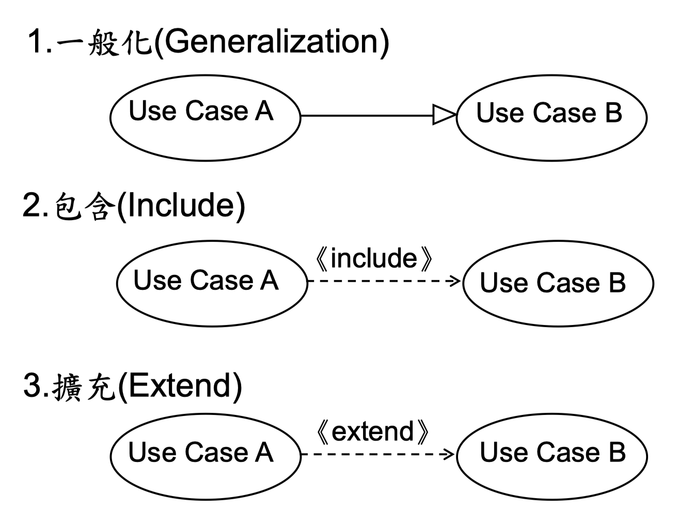
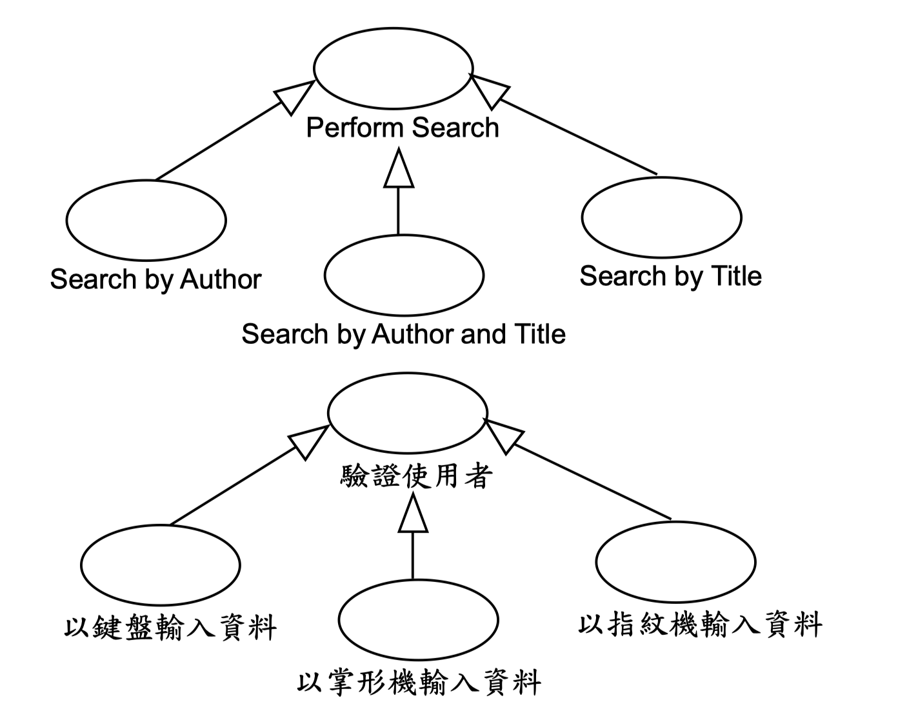
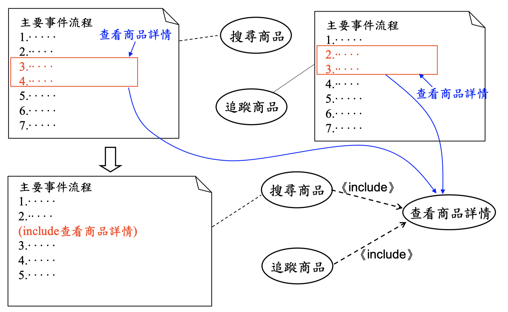
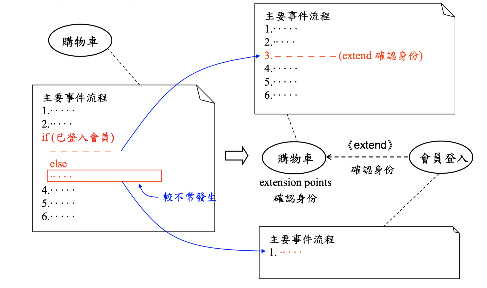

# User Story

* 驗收測試是在coding之前撰寫
* Product Backlog: 待辦清單

> Product -&gt; Release\(version\) -&gt; use case\(Feature\) -&gt; user story

## use case 三種關係

### 一般化\(Generalization\):繼承

### 包含\(Include\)

> * 把共同部分做抽離
> * 很常用，所以非常重要
> * 『包含正常、擴充相反』

### 擴充\(Extend\)

