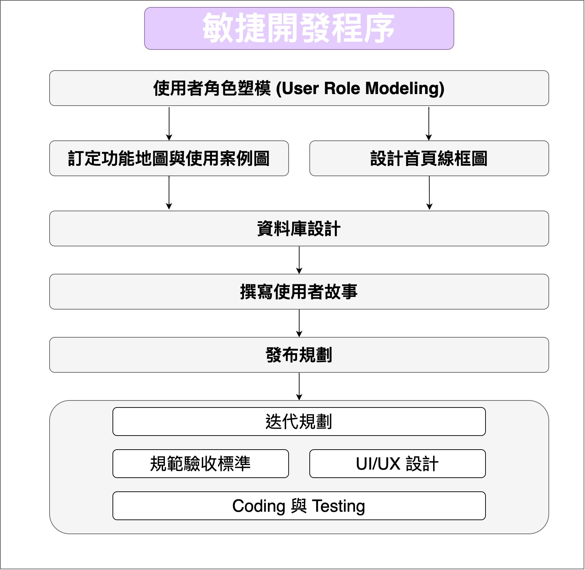

# JavaBeans


## JavaBeans 介紹

> **包裝資料，重複使用**

### 三個特性

1. * 必須是一個 public 類別
   * 必須有一個不傳入參數的 public 建構子
2. 取得或設定屬性\(properties\)時，必須用 getXxx 或 setXxx 的方法
3. 必須是一個可序列化\(Serializable\)的類別，指 implements java.io.Serializable 空介面

```java
public class Animal {
	private int age;
	private float weight;
	public Animal(int age, float weight) {
		this.age = age;
		this.weight = weight;
	}
	public void speak() {
		System.out.println("年紀為" + age + "歲");
		System.out.println("體重為" + weight + "公斤");
	}
	public int getAge() {
		return age;
	}
	public void setAge(int age) {
		this.age = age;
	}
	public float getWeight() {
		return weight;
	}
	public void setWeight(float weight) {
		this.weight = weight;
	}
}
```



