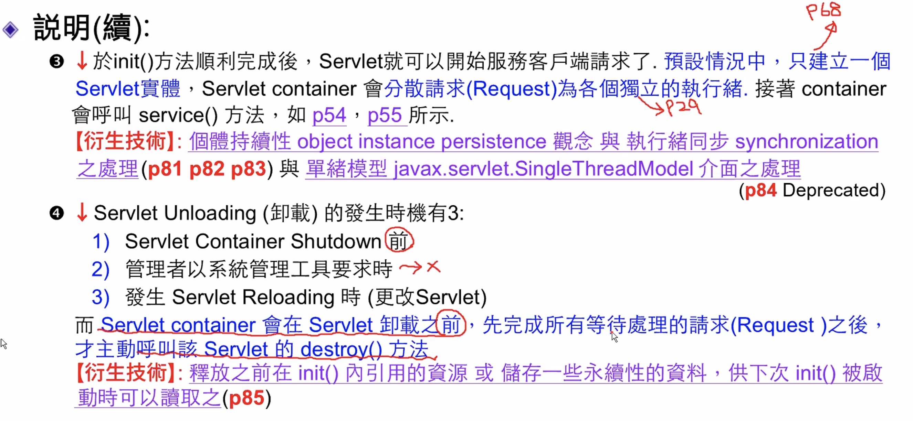

# Servlet Life Cycle

## 四個生命週期

### 創建實體

* Servlet Reloading \(Servlet 重載入\) -&gt;**例外**
* Load on Startup \(啟動時載入\) -&gt;**例外**

### 初始化

* Init Parameter \(初始參數\)

### 服務

* Persistence vs Synchronization
* Single Thread Model \(單緒模型\)\(Deprecated\)

### 卸載

* Initial & Destroy \(協同運作\)

## 生命週期基本概念（測試）

 

* Servlet container: 替我們建立servlet實體，並由其控制呼叫servlet的`init()`, `service()`, `destroy()`等方法，以管理servlet的生命週期
* 程式設計師：則藉由提供上述方法之實作，予以控制該servlet物件及與該物件相關之resource

  

