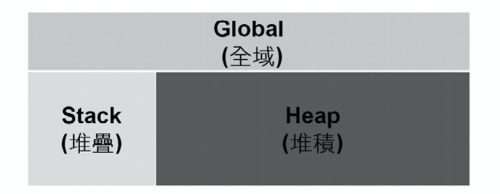

# 參考型別

## 使用物件參考

利用類別\(class\)建立並使用物件\(object\)

### 有如遙控器的概念

* 要使用「物件」，必須使用該物件的「物件參考變數」\(簡稱「物件參考」或「參考變數」\)
* 概念上有如「電子產品」由「遙控器」遠端操控

| 名稱         | 概念     | 舉例  |
| :----------- | :------- | :---- |
| 物件參考變數 | 遙控器   | myPen |
| 物件         | 電子產品 | Pen   |

### 由類別\(class\)建構物件

建構物件有三個程序：

1. 宣告\(Declaration\)

   語法：`ClassName reference(物件參考變數);`

2. 實體化\(Instantiation\)

   語法：`new ClassName;`

3. 將實體指定給物件參考，完成初始化\(Initialization\)

   語法：`reference = new ClassName`

```java
// 1. 宣告
Book myBook;
// Pen為類別名稱
// myPen為物件參考變數
```

```java
// 2. 實體化
new Book();
// pen為類別名稱，將使用該類別產生物件實體
```

```java
// 3. 初始化
myBook = new Book();
// 因無法直接碰觸記憶體裡的Pen物件，故使用物件參考myPen來控制
```

```java
// 完整程序：
Book myBook = new Book();
```

比較基本型別和參考型別的變數宣告：

| 項目         | 型別 | 變數   | 指派運算子 | 記憶體內容   |
| :----------- | :--- | :----- | :--------- | :----------- |
| 基本型別範例 | int  | x      | =          | 10           |
| 參考型別範例 | Book | myBook | =          | new Book\(\) |

### 對不同物件使用不同物件參考

不同種類物件，即使同種但不同的物件，都該使用各自的物件參考\(遙控器\)來對物件進行控制：

```java
Book myBook1 = new Book;
myBook1.publishing();
Book myBook2 = new Book;
myBook2.publishing();
Pen myPen = new Pen();
myPen.write();
```

目前以上例來說，「宣告型別\(reference type\)」與所參照的「物件型態\(object type\)」都相同，兩者均為Book，實際上並不需要相同。以遙控器的比喻來說，目前一種遙控器只能控制一種裝置，但實務上有**通用遙控器**，經過一些設定後就能控制同種但不同品牌的電子產品，即為「**多型**」的概念。

### JVM記憶體分類

Java記憶體分三大區塊：

1. Global\(全域\)
   * 保存static的類別成員變數的地方
2. Stack\(堆疊\)
   * 保存基本型別\(primitive type\)的變數和變數內容\(value\)的地方
   * 保存參考型別\(reference type\)的變數的地方
3. Heap\(堆積\)
   * 保存參考型別\(reference type\)的變數內容\(instance\)的地方



Stack和Heap歸納如下：

| 分類     | 變數&變數值       | Stack | Heap  |
| :------- | :---------------- | :---: | :---: |
| 基本型別 | 變數              |   O   |       |
| 基本型別 | 值                |   O   |       |
| 參考型別 | 變數\(物件參考\) |   O   |       |
| 參考型別 | 值\(物件實體\)    |       |   O   |

## 使用String類別

* String類別屬於參考型別，使用時會產生物件
* String物件可以不使用new關鍵字進行實體化，好處是透過字串池避免記憶體浪費

### String類別的其他方法

| 方法                              | 功能                               |
| :-------------------------------- | :--------------------------------- |
| `length()`                        | 取得字串長度                       |
| `toUpperCase()` / `toLowerCase()` | 將字串內的字元全部轉換為大寫或小寫 |
| `trim()`                          | 去除字串前後空白                   |
| `substring()`                     | 由字串內取出全部字串               |
| `endsWith()`                      | 判斷字串結尾                       |

### StringBuilder

## 基本型別的包覆類別

| 基本型別 | 包覆類別      |
| -------- | ------------- |
| byte     | Byte          |
| short    | Short         |
| int      | **Integer**   |
| long     | Long          |
| float    | Float         |
| double   | Double        |
| char     | **Character** |
| boolean  | Boolean       |

[參考型別的包覆類別](variable.md#基本型別)