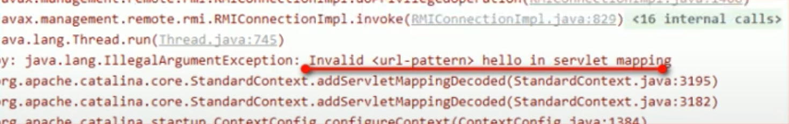

# Servlet Web

## 什麼是Servlet

* 是JavaEE規範之一，規範即介面
* 為JavaWeb三大組成之一\(三大組成：Servlet程序、Filter過濾器、Listener監聽器\)
* 是用Java編寫的伺服器端程式。其主要功能在於互動式地瀏覽和修改資料，生成動態Web內容

## 動手實作Servlet程序

1. 編寫一個class去實作Servlet介面
2. 實現service方法，處理請求，並回應數據
3. 到web.xml中設定servlet程序的連接位址
   * 常見錯誤1：url-pattern中設置的路徑沒有以/斜線開頭
   * 常見錯誤2：servlet-name設置的值不存在
   * 常見錯誤3：servlet-class名稱錯誤

     

```java
package ken.servlet.test;

import java.io.IOException;

import javax.servlet.Servlet;
import javax.servlet.ServletConfig;
import javax.servlet.ServletException;
import javax.servlet.ServletRequest;
import javax.servlet.ServletResponse;

public class HelloServlet implements Servlet {

    @Override
    public void destroy() {
        // TODO Auto-generated method stub

    }

    @Override
    public ServletConfig getServletConfig() {
        // TODO Auto-generated method stub
        return null;
    }

    @Override
    public String getServletInfo() {
        // TODO Auto-generated method stub
        return null;
    }

    @Override
    public void init(ServletConfig arg0) throws ServletException {
        // TODO Auto-generated method stub

    }

    @Override
    public void service(ServletRequest arg0, ServletResponse arg1) throws ServletException, IOException {
        System.out.println("Hello Servlet 已連接");

    }

}
```

web.xml:

```markup
<?xml version="1.0" encoding="UTF-8"?>
<web-app xmlns:xsi="http://www.w3.org/2001/XMLSchema-instance"
    xmlns="http://xmlns.jcp.org/xml/ns/javaee"
    xsi:schemaLocation="http://xmlns.jcp.org/xml/ns/javaee http://xmlns.jcp.org/xml/ns/javaee/web-app_4_0.xsd"
    id="WebApp_ID" version="4.0">
    <display-name>ServletTest</display-name>
    <welcome-file-list>
        <welcome-file>index.html</welcome-file>
        <welcome-file>index.htm</welcome-file>
        <welcome-file>index.jsp</welcome-file>
        <welcome-file>default.html</welcome-file>
        <welcome-file>default.htm</welcome-file>
        <welcome-file>default.jsp</welcome-file>
    </welcome-file-list>

    <!-- servlet標籤給Tomcat設置servlet程序 -->
    <servlet>
        <servlet-name>HelloServlet</servlet-name>
        <servlet-class>ken.servlet.test.HelloServlet</servlet-class>
    </servlet>

    <servlet-mapping>
        <servlet-name>HelloServlet</servlet-name>
        <!--
            url-pattern標籤設定連接位址
            / 斜線在伺服器解析時，表示地址為：http://ip:port/工程路徑
            /hello 表示地址為：http://ip:port/工程路徑/hello
         -->
        <url-pattern>/hello</url-pattern>
    </servlet-mapping>

</web-app>
```

## url位址如何與servlet程序連接

