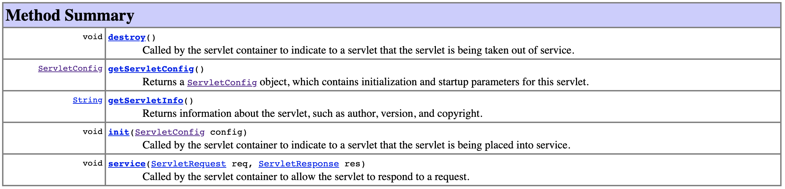
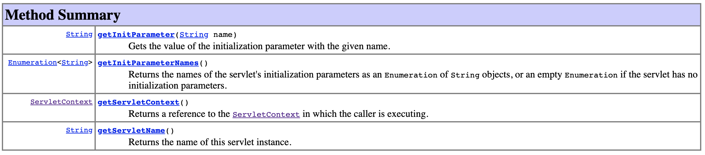

# Servlet Interface

## Servlet

* `destroy()`
* `init(ServletConfig config))`
* `service(ServletRequest req, ServletResponse res)`

## ServletConfig

* `getInitParameter(String name)`
* `getInitParameterNames()`
* `getServletContext()`
* `getServletName()`

