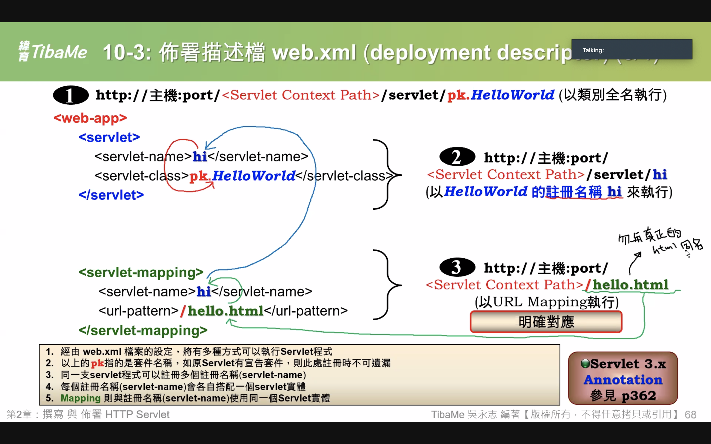

# web.xml部署檔

> 這個是應用程式部屬的描述檔，一定放在web.xml下，簡單來說，這個是用來起始程式的開始點.



```markup
<web-app>
    <servlet>                           <!-- 已經無法以註冊名稱(http://localhost:8081/IBM/servlet/hi)的方式執行,因為Invoker servlet的功能在Tomcat 7.x 已經被移除 -->
        <servlet-name>hi</servlet-name>
        <servlet-class>HelloWorld</servlet-class>
    </servlet>
    <servlet-mapping>                   <!-- 明確對應 http://localhost:8081/IBM/hello.html -->
        <servlet-name>hi</servlet-name>
        <url-pattern>/hello.html</url-pattern>
    </servlet-mapping>
    <servlet-mapping>                   <!-- 前置路徑對應 http://localhost:8081/IBM/hello.html/xxxxx -->
        <servlet-name>hi</servlet-name>
        <url-pattern>/hello.html/*</url-pattern>
    </servlet-mapping>
    <servlet-mapping>                   <!-- 延伸檔名對應 http://localhost:8081/IBM/xxx/yyy/zzz.mm-->
        <servlet-name>hi</servlet-name>
        <url-pattern>*.mm</url-pattern>
    </servlet-mapping>
</web-app>
```

1. servlet開始，servlet結束
   1. servlet-name
   2. servlet-class
2. servlet-mapping開始，servlet-mapping結束
   1. servlet-name
   2. url-pattern

